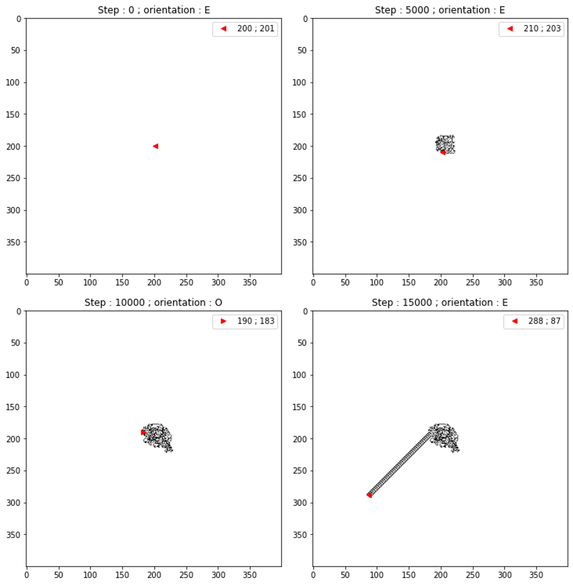
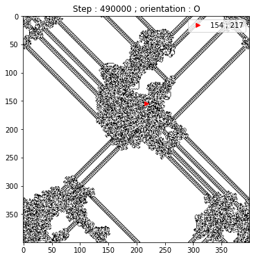
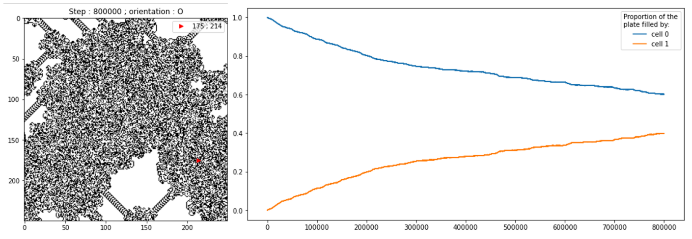
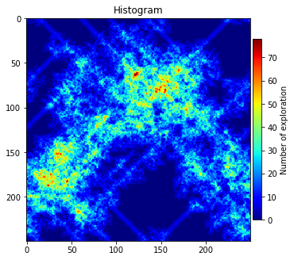
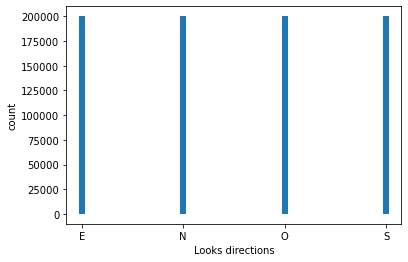
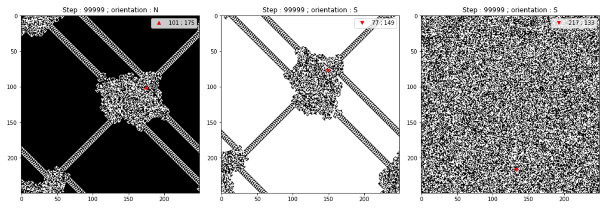

# Langton-ant
A self implementation of the cellular automaton named the Langton-ant.

#### Inside function :

 * white_right_step: Function to update the state of the ant and of the plate. The rule applied by this function is if the ant is on a white cell (equal	to 0) then this cell turn to black (equal to 1), the ant turn on herself 	at 90° to the right and advance one square. Otherwise, if the ant is on a black cell, this on turn to white, the ant turn on herself at 90° to the left and advance one square.
 
 * white_left_step: Function to update the state of the ant and of the plate.	The rule applied by this function is if the ant is on a white cell (equal	to 0) then this cell turn to black (equal to 1), the ant turn on herself	at 90° to the left and advance one square. Otherwise, if the ant is on a	black cell, this on turn to white, the ant turn on herself at 90° to the right and advance one square.
 
 * plot_state: Function to plot the sate of the plate and of the ant.
 
 * plot_black_white_rate: Function to plot the evolution of the filling of the plate by cells equal	to 0 or to 1.
 
 * hist_visit_cells: Function to show the frenquentation of the cells of the plate.
 
 * hist_looks: Function to plot the distribution of the direction in which the ant have	looked during the evolution.
 
 * langton_ant: Function to create and make evolve a Langton ant model.
 
 ### Some exemple of the possibility:
 
 Some step plot with: langton_ant('white_right', 400, 15000, walk=1000)
 
 
 The 490 000-th iteration of: langton_ant('white_right', 400, 500000, trap=True, walk=10000)
 

Final stage and the history of the proportion of white and black cell with: langton_ant('white_right', 250, 800000, trap=True, walk=400000)

2d histogram of the exploration of the cell with: langton_ant('white_right', 250, 800000, trap=True, walk=400000)

Distribution of the looks with: langton_ant('white_right', 250, 800000, trap=True, walk=400000)

Final stage for: langton_ant('white_right', 250, 100000, trap=True, fill='1', walk=100000), langton_ant('white_left', 250, 100000, trap=True, walk=100000), langton_ant('white_right', 250, 100000, trap=True, fill='rand', walk=100000)

